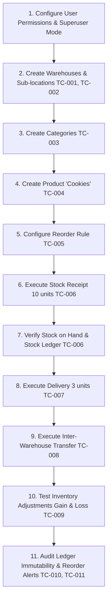

# StockSense — Complete Workflow Testing Guide

**Author:** Senior QA Engineer & Odoo 17 Developer  
**Module Name:** `stocksense` (StockSense - Inventory Management System)  
**Framework:** Odoo 17 Community Edition  
**Environment:** Docker Compose on Windows  
**Database:** `stocksense_db`  
**Odoo URL:** [http://localhost:8069](http://localhost:8069)  
**Report File:** `STOCKSENSE_WORKFLOW_TESTING_GUIDE.md`  

---

## 1. Application Overview

### 1.1 Architecture & Core Business Principles
StockSense is a custom Odoo 17 inventory management application engineered around an **auditable, append-only movement ledger**. The system guarantees full traceability across physical warehouses and virtual locations.

The architecture enforces a strict **Three-Layer Separation**:

1. **Layer 1: Business Operations (`stocksense.operation`)**  
   Represents business intent (Receipts, Deliveries, Internal Transfers, Inventory Adjustments). It carries a strict state lifecycle (`draft` → `confirmed` → `done` or `cancelled`).
2. **Layer 2: Inventory Movements (`stocksense.movement`)**  
   Represents immutable, append-only stock movement ledger entries generated automatically when an operation transitions to the `done` state. Movements record *who, what, when, where, and why* stock changed.
3. **Layer 3: Stock Balance Cache (`stocksense.stock`)**  
   A hybrid cached model storing the current on-hand quantity for every `(product_id, location_id)` pair. It is updated atomically within the same transaction during movement creation.

```
┌─────────────────────────┐      validates      ┌─────────────────────────┐
│  stocksense.operation   │ ──────────────────► │   stocksense.movement   │
│   (Business Document)   │                     │  (Append-Only Ledger)   │
└─────────────────────────┘                     └────────────┬────────────┘
                                                             │
                                                     updates │ atomically
                                                             ▼
                                                ┌─────────────────────────┐
                                                │    stocksense.stock     │
                                                │  (On-Hand Qty Cache)    │
                                                └─────────────────────────┘
```

---

## 2. Model and Workflow Summary

### 2.1 Model Specifications

| Model Technical Name | Model Description | Key Fields & Logic |
| :--- | :--- | :--- |
| `stocksense.category` | Product Category | `name`, `parent_id`, `complete_name` (computed recursive), `child_ids`, `product_count` (computed search_count). Tree structure supported. |
| `stocksense.product` | Product Master Data | `name`, `sku` (unique code), `category_id`, `uom` (Selection), `weight`, `volume`, `barcode`, `total_stock` (computed across internal locations), `stock_ids`, `movement_ids`, `reorder_rule_ids`. |
| `stocksense.warehouse` | Physical Warehouse | `name`, `code` (5-char max unique code), `lot_stock_id` (auto-generated main stock location), `location_ids`, `address`. Overrides `create()` to auto-generate default `Stock`, `Input`, and `Output` internal locations. |
| `stocksense.location` | Location Master Data | `name`, `complete_name` (computed path), `location_type` (`internal`, `supplier`, `customer`, `adjustment`, `transit`), `warehouse_id`, `parent_id`, `is_default`, `stock_count`. |
| `stocksense.operation` | Inventory Operation | `name` (sequence-generated: `REC/`, `DEL/`, `INT/`, `ADJ/`), `operation_type`, `state` (`draft`, `confirmed`, `done`, `cancelled`), `date`, `date_done`, `product_id`, `quantity`, `uom` (related), `source_location_id`, `destination_location_id`, `partner_name`, `reason`, `movement_ids`, `movement_count`. |
| `stocksense.movement` | Stock Movement Ledger | Read-only ledger. `name` (computed), `product_id`, `source_location_id`, `destination_location_id`, `quantity`, `uom`, `movement_type` (`receipt`, `delivery`, `internal`, `adjustment_in`, `adjustment_out`), `operation_id`, `date`, `user_id`, `reason`. Immutability enforced in `write()` and `unlink()`. |
| `stocksense.stock` | Stock Balance | `product_id`, `location_id`, `quantity` (cached on-hand), `uom`, `is_below_reorder` (computed), `reorder_min_qty`. Updated by `_update_quantity()` using atomic SQL `UPDATE`. Unique constraint on `(product_id, location_id)`. |
| `stocksense.reorder.rule` | Reorder Rule | `product_id`, `location_id` (internal), `warehouse_id` (related), `min_quantity`, `max_quantity`, `reorder_quantity`, `current_stock` (computed), `is_triggered` (computed alert flag). |

---

## 3. Navigation Guide

All functionality is accessed under the main top-level menu **StockSense** in the Odoo UI.

```
StockSense (Root Menu)
├── Operations
│   ├── All Operations (`action_operation_all`)
│   ├── Receipts (`action_operation_receipt`)
│   ├── Deliveries (`action_operation_delivery`)
│   ├── Internal Transfers (`action_operation_internal`)
│   └── Adjustments (`action_operation_adjustment`)
├── Inventory
│   ├── Stock on Hand (`action_stock`)
│   ├── Stock Ledger (`action_movement`)
│   └── Reorder Rules (`action_reorder_rule`)
├── Master Data
│   ├── Products (`action_product`)
│   └── Categories (`action_category`)
└── Configuration (Manager Group Only)
    ├── Warehouses (`action_warehouse`)
    └── Locations (`action_location`)
```

---

## 4. Prerequisites and Initial Setup

### 4.1 System-Defined Data (Loaded on Module Install)
The XML data file `data/location_data.xml` provisions three system virtual locations:
* **Suppliers** (`stocksense.location_suppliers`, `location_type = 'supplier'`)
* **Customers** (`stocksense.location_customers`, `location_type = 'customer'`)
* **Inventory Adjustment** (`stocksense.location_adjustment`, `location_type = 'adjustment'`)

### 4.2 User Security Groups (`security/security_groups.xml`)
* **StockSense User (`stocksense.group_stocksense_user`)**: Read access to master data and stock balances; read/create/write on operations.
* **StockSense Manager (`stocksense.group_stocksense_manager`)**: Full CRUD permissions on categories, products, warehouses, locations, operations, and reorder rules; access to Configuration menu.

> [!IMPORTANT]
> **Superuser Requirement for Operation Validation:**  
> Because `ir.model.access.csv` defines `perm_create = 0` for `stocksense.movement`, users validating operations must execute in Superuser mode (or `_create_movements()` must use `.sudo()`) to bypass the create permission check on the immutable movement model.

---

## 5. Consolidated Sample Test Data

Use the following standardized dataset across all manual test procedures:

### Master Data Table

| Entity | Record Name | Technical / Reference Code | Attributes / Parent |
| :--- | :--- | :--- | :--- |
| **Category** | Baked Goods | `Baked Goods` | Parent: None |
| **Category** | Snacks | `Snacks` | Parent: `Baked Goods` |
| **Product** | Cookies | SKU: `COOKIE-001` | Category: `Baked Goods`, UoM: `Units`, Weight: `0.050 kg`, Volume: `0.0001 m³`, Barcode: `8901001000012` |
| **Warehouse** | Main Warehouse | Code: `MW` | Auto-creates `MW / Stock`, `MW / Stock / Input`, `MW / Stock / Output` |
| **Warehouse** | Secondary Warehouse | Code: `SW` | Auto-creates `SW / Stock`, `SW / Stock / Input`, `SW / Stock / Output` |
| **Location** | Shelf A1 | `MW / Stock / Shelf A1` | Type: `Internal`, Parent: `MW / Stock`, Warehouse: `Main Warehouse` |
| **Reorder Rule** | Cookies @ MW / Stock | N/A | Product: `Cookies`, Location: `MW / Stock`, Min Qty: `5.00`, Max Qty: `50.00`, Reorder Qty: `20.00` |

### Operations Sample Data Table

| Test Case | Operation Type | Product | Source Location | Destination Location | Qty | Partner |
| :--- | :--- | :--- | :--- | :--- | :--- | :--- |
| **TC-006** | Receipt | Cookies | *Auto (Suppliers)* | `MW / Stock` | 10.00 | Sweet Treats Co. |
| **TC-007** | Delivery | Cookies | `MW / Stock` | *Auto (Customers)* | 3.00 | Cafe Central |
| **TC-008** | Internal Transfer | Cookies | `MW / Stock` | `SW / Stock` | 2.00 | N/A |
| **TC-009A** | Adjustment (Gain) | Cookies | *Auto (Adjustment)* | `MW / Stock` | 5.00 | N/A |
| **TC-009B** | Adjustment (Loss) | Cookies | `MW / Stock` | `Inventory Adjustment` | 1.00 | N/A |

---

## 6. Step-by-Step Workflow Test Cases

### Test Case TC-001: Warehouse Creation & Auto-Location Generation
* **Objective:** Verify that creating a warehouse automatically generates default internal locations (`Stock`, `Input`, `Output`).
* **Prerequisites:** User logged in as StockSense Manager.
* **Navigation:** `StockSense > Configuration > Warehouses`
* **Sample Data:** Name: `Main Warehouse`, Short Code: `MW`, Address: `100 Logistics Way`
* **Steps:**
  1. Click **New** (or **Create**).
  2. Enter Warehouse Name: `Main Warehouse`.
  3. Enter Short Code: `MW`.
  4. Enter Address: `100 Logistics Way`.
  5. Click **Save** (Cloud icon / Alt+S).
* **Expected Result:**
  * Warehouse saved successfully.
  * Field `Default Stock Location` displays `MW / Stock`.
  * Notebook page **Locations** displays 3 sub-locations: `MW / Stock` (Default = True), `MW / Stock / Input`, and `MW / Stock / Output`.
* **Verification:** Navigate to `StockSense > Configuration > Locations`. Search for `MW`. Verify all 3 locations exist with `location_type = 'internal'`.
* **Cleanup:** Retain for subsequent test cases.

---

### Test Case TC-002: Sub-Location Hierarchy Creation
* **Objective:** Verify user can create custom child locations under a warehouse stock location.
* **Prerequisites:** TC-001 completed.
* **Navigation:** `StockSense > Configuration > Locations`
* **Sample Data:** Name: `Shelf A1`, Location Type: `Internal Location`, Warehouse: `Main Warehouse`, Parent Location: `MW / Stock`
* **Steps:**
  1. Click **New**.
  2. Enter Location Name: `Shelf A1`.
  3. Select Location Type: `Internal Location`.
  4. Select Warehouse: `Main Warehouse`.
  5. Select Parent Location: `MW / Stock`.
  6. Click **Save**.
* **Expected Result:** Full Location Path (`complete_name`) updates to `MW / Stock / Shelf A1`.
* **Verification:** Check the tree view under `StockSense > Configuration > Locations`. `MW / Stock / Shelf A1` appears under parent `MW / Stock`.
* **Cleanup:** Retain data.

---

### Test Case TC-003: Product Category Setup
* **Objective:** Create parent and child product categories.
* **Prerequisites:** None.
* **Navigation:** `StockSense > Master Data > Categories`
* **Sample Data:** Category 1 Name: `Baked Goods`; Category 2 Name: `Snacks` (Parent: `Baked Goods`).
* **Steps:**
  1. Click **New**. Enter Name: `Baked Goods`. Click **Save**.
  2. Click **New**. Enter Name: `Snacks`. Select Parent Category: `Baked Goods`. Click **Save**.
* **Expected Result:**
  * Category 1 `complete_name` is `Baked Goods`.
  * Category 2 `complete_name` is `Baked Goods / Snacks`.
* **Verification:** Verify tree view shows both categories with correct complete names.
* **Cleanup:** Retain data.

---

### Test Case TC-004: Product Creation (Cookies)
* **Objective:** Create a product master record with SKU, category, and UoM.
* **Prerequisites:** TC-003 completed.
* **Navigation:** `StockSense > Master Data > Products`
* **Sample Data:**
  * Product Name: `Cookies`
  * SKU / Internal Reference: `COOKIE-001`
  * Category: `Baked Goods`
  * Unit of Measure: `Units`
  * Weight: `0.050`
  * Volume: `0.0001`
  * Barcode: `8901001000012`
* **Steps:**
  1. Click **New**.
  2. Enter Product Name: `Cookies`.
  3. Enter SKU: `COOKIE-001`.
  4. Select Category: `Baked Goods`.
  5. Select Unit of Measure: `Units`.
  6. Fill Weight: `0.050` and Volume: `0.0001`.
  7. Enter Barcode: `8901001000012`.
  8. Click **Save**.
* **Expected Result:**
  * Product record created.
  * Stat button `On Hand` displays `0.00 Units`.
  * Tab `Stock by Location` is empty.
* **Verification:** Check list view in `StockSense > Master Data > Products`. `COOKIE-001` displays Total Stock = `0.00`.
* **Cleanup:** Retain data.

---

### Test Case TC-005: Reorder Rule Creation
* **Objective:** Set up minimum stock threshold monitoring for a product-location pair.
* **Prerequisites:** TC-001, TC-004 completed.
* **Navigation:** `StockSense > Inventory > Reorder Rules`
* **Sample Data:** Product: `Cookies`, Location: `MW / Stock`, Minimum Quantity: `5.00`, Maximum Quantity: `50.00`, Reorder Quantity: `20.00`
* **Steps:**
  1. Click **New**.
  2. Select Product: `[COOKIE-001] Cookies`.
  3. Select Location: `MW / Stock`.
  4. Set Minimum Quantity: `5.00`.
  5. Set Maximum Quantity: `50.00`.
  6. Set Reorder Quantity: `20.00`.
  7. Click **Save**.
* **Expected Result:**
  * Reorder rule created.
  * `Current Stock` displays `0.00`.
  * `Alert Triggered` (`is_triggered`) checkbox is **checked (True)** (since 0.00 <= 5.00).
* **Verification:** Row is highlighted in red/danger style in the Reorder Rules tree view.
* **Cleanup:** Retain data.

---

### Test Case TC-006: Stock Receipt Workflow (Draft → Confirmed → Done)
* **Objective:** Receive 10 units of Cookies into `MW / Stock` and verify movement ledger & stock balance update.
* **Prerequisites:** TC-001, TC-004 completed. Ensure user is running in Superuser mode to complete operation validation.
* **Navigation:** `StockSense > Operations > Receipts`
* **Sample Data:** Operation Type: `Receipt`, Product: `Cookies`, Destination Location: `MW / Stock`, Quantity: `10.00`, Partner: `Sweet Treats Co.`, Reason: `Initial stock replenishment`
* **Steps:**
  1. Click **New**.
  2. Operation Type defaults to `Receipt`.
  3. Select Product: `[COOKIE-001] Cookies`.
  4. Enter Quantity: `10.00`.
  5. Select Destination Location: `MW / Stock` (must be an internal location!).
  6. Enter Partner: `Sweet Treats Co.`.
  7. Enter Reason: `Initial stock replenishment`.
  8. Click **Save**. Status bar displays `Draft`. Reference displays `REC/2026/00001`.
  9. Click **Confirm** button. Status transitions to `Confirmed`.
  10. Click **Validate** button. Status transitions to `Done`. `Completed Date` is populated.
* **Expected Result:**
  * Operation state changes to `Done`.
  * Stat button `Movements` appears with value `1`.
  * Notebook page `Movements` shows 1 entry: `Suppliers` → `MW / Stock`, Qty: `10.00`, Type: `Receipt`.
* **Verification:**
  1. Go to `StockSense > Inventory > Stock on Hand`. Observe record for `Cookies` at `MW / Stock` with On Hand Quantity = `10.00`.
  2. Go to `StockSense > Inventory > Stock Ledger`. Observe movement `REC/2026/00001 (Receipt)` for 10.00 units.
  3. Go to `StockSense > Inventory > Reorder Rules`. Observe `Alert Triggered` is now **unchecked (False)** (10.00 > 5.00).
* **Cleanup:** Retain data.

---

### Test Case TC-007: Stock Delivery Workflow (With Stock Availability Check)
* **Objective:** Deliver 3 units of Cookies to a customer and verify stock depletion.
* **Prerequisites:** TC-006 completed (10 units in stock).
* **Navigation:** `StockSense > Operations > Deliveries`
* **Sample Data:** Operation Type: `Delivery`, Product: `Cookies`, Source Location: `MW / Stock`, Quantity: `3.00`, Partner: `Cafe Central`
* **Steps:**
  1. Click **New**.
  2. Select Product: `[COOKIE-001] Cookies`.
  3. Select Source Location: `MW / Stock`.
  4. Enter Quantity: `3.00`.
  5. Enter Partner: `Cafe Central`.
  6. Click **Save**. Reference displays `DEL/2026/00001`.
  7. Click **Validate**.
* **Expected Result:**
  * Operation transitions to `Done`.
  * 1 Movement created: `MW / Stock` → `Customers`, Qty: `3.00`, Type: `Delivery`.
* **Verification:**
  1. Go to `StockSense > Inventory > Stock on Hand`. On Hand Quantity at `MW / Stock` is now `7.00` (10.00 - 3.00).
  2. Go to `StockSense > Master Data > Products`. Total Stock for Cookies displays `7.00`.
* **Cleanup:** Retain data.

---

### Test Case TC-007B: Delivery Stock Availability Validation (Failure Test)
* **Objective:** Verify that delivering more stock than available triggers a UserError.
* **Prerequisites:** TC-007 completed (7 units remaining at `MW / Stock`).
* **Navigation:** `StockSense > Operations > Deliveries`
* **Sample Data:** Product: `Cookies`, Source Location: `MW / Stock`, Quantity: `15.00`
* **Steps:**
  1. Click **New**.
  2. Select Product: `Cookies`, Source Location: `MW / Stock`, Quantity: `15.00`.
  3. Click **Save**.
  4. Click **Validate**.
* **Expected Result:**
  * Validation fails.
  * Odoo surfaces UserError modal:  
    `Insufficient stock at MW / Stock. Available: 7.00 Units Required: 15.00 Units`.
  * Operation remains in `Draft` state; no movements created.
* **Cleanup:** Click **Cancel** on the operation or delete draft.

---

### Test Case TC-008: Internal Transfer Workflow
* **Objective:** Transfer 2 units of Cookies from `MW / Stock` to `SW / Stock` across warehouses.
* **Prerequisites:** TC-001 (Warehouse `SW` created), TC-007 completed (7 units in `MW / Stock`).
* **Navigation:** `StockSense > Operations > Internal Transfers`
* **Sample Data:** Product: `Cookies`, Source Location: `MW / Stock`, Destination Location: `SW / Stock`, Quantity: `2.00`
* **Steps:**
  1. Click **New**.
  2. Select Product: `Cookies`.
  3. Select Source Location: `MW / Stock`.
  4. Select Destination Location: `SW / Stock`.
  5. Enter Quantity: `2.00`.
  6. Click **Save**. Reference displays `INT/2026/00001`.
  7. Click **Validate**.
* **Expected Result:**
  * Operation state changes to `Done`.
  * Movement created: `MW / Stock` → `SW / Stock`, Qty: `2.00`, Type: `Internal Transfer`.
* **Verification:**
  1. Check `StockSense > Inventory > Stock on Hand`:
     * `MW / Stock`: `5.00` Units.
     * `SW / Stock`: `2.00` Units.
  2. Product Total Stock across internal locations remains `7.00` (5.00 + 2.00 = 7.00). Total company stock is conserved.
* **Cleanup:** Retain data.

---

### Test Case TC-009A: Inventory Adjustment — Stock Gain
* **Objective:** Record an uncounted stock gain of 5 units at `MW / Stock`.
* **Prerequisites:** TC-008 completed.
* **Navigation:** `StockSense > Operations > Adjustments`
* **Sample Data:** Product: `Cookies`, Destination Location: `MW / Stock`, Quantity: `5.00`, Reason: `Found extra box during annual audit`
* **Steps:**
  1. Click **New**.
  2. Select Operation Type: `Adjustment`.
  3. Select Product: `Cookies`.
  4. Leave Source Location empty (defaults to virtual `Inventory Adjustment`).
  5. Select Destination Location: `MW / Stock`.
  6. Enter Quantity: `5.00`.
  7. Enter Reason: `Found extra box during annual audit`.
  8. Click **Save** and **Validate**.
* **Expected Result:**
  * Operation state changes to `Done`.
  * Movement created: `Inventory Adjustment` → `MW / Stock`, Qty: `5.00`, Type: `Adjustment (Stock In)`.
  * Stock at `MW / Stock` increases from `5.00` to `10.00`.
* **Verification:** Check `StockSense > Inventory > Stock on Hand`. `MW / Stock` shows `10.00` units.
* **Cleanup:** Retain data.

---

### Test Case TC-009B: Inventory Adjustment — Stock Loss
* **Objective:** Record a stock loss of 1 unit due to damage at `MW / Stock`.
* **Prerequisites:** TC-009A completed (10 units at `MW / Stock`).
* **Navigation:** `StockSense > Operations > Adjustments`
* **Sample Data:** Product: `Cookies`, Source Location: `MW / Stock`, Destination Location: `Inventory Adjustment`, Quantity: `1.00`, Reason: `Water damage on bottom shelf`
* **Steps:**
  1. Click **New**.
  2. Select Operation Type: `Adjustment`.
  3. Select Product: `Cookies`.
  4. Select Source Location: `MW / Stock` (internal location indicates stock loss).
  5. Select Destination Location: `Inventory Adjustment` (virtual adjustment location).
  6. Enter Quantity: `1.00`.
  7. Enter Reason: `Water damage on bottom shelf`.
  8. Click **Save** and **Validate**.
* **Expected Result:**
  * Operation state changes to `Done`.
  * Movement created: `MW / Stock` → `Inventory Adjustment`, Qty: `1.00`, Type: `Adjustment (Stock Out)`.
  * Stock at `MW / Stock` decreases from `10.00` to `9.00`.
* **Verification:** Check `StockSense > Inventory > Stock on Hand`. `MW / Stock` displays `9.00` units. Total company stock = `11.00` (9.00 @ MW + 2.00 @ SW).
* **Cleanup:** Retain test data for ledger audit testing.

---

### Test Case TC-010: Stock Ledger Immutability & Auditability
* **Objective:** Verify that ledger movement entries cannot be created, edited, or deleted manually from the UI or ORM.
* **Prerequisites:** TC-006 through TC-009B completed.
* **Navigation:** `StockSense > Inventory > Stock Ledger`
* **Steps & Verification:**
  1. Open `StockSense > Inventory > Stock Ledger`.
  2. Observe list view: **Create** button is absent (`create="0"`).
  3. Click any movement record to open form view.
  4. Observe form view: **Edit** button is absent (`edit="0"`). All fields are read-only.
  5. Check Action dropdown: **Delete** option is absent (`delete="0"`).
* **Expected Result:** Stock ledger enforces total immutability in accordance with the append-only ledger design.

---

## 7. Investigation of Existing Errors

### Error 1: "Receipt destination must be an internal location."

#### Root Cause Analysis
* **File Location:** `models/operation.py`, lines 218–226 in method `_check_locations()`:
  ```python
  if op.operation_type == 'receipt':
      if not op.destination_location_id:
          raise ValidationError('Receipt operations require a destination location.')
      if op.destination_location_id.location_type != 'internal':
          raise ValidationError('Receipt destination must be an internal location.')
  ```
* **Explanation:**  
  In StockSense, a Receipt represents incoming inventory arriving from an external vendor (virtual `Suppliers` location) into a physical warehouse storage area (internal location).  
  This error occurs when creating/editing a Receipt operation if:
  1. The `Destination Location` field is left blank.
  2. A virtual location (such as `Suppliers`, `Customers`, or `Inventory Adjustment`) is selected as the destination.
  3. No warehouse or internal location has been created yet in the database.

#### Error Classification
**Configuration / User Input Issue.** (The user selected an invalid location type for a receipt or attempted to create a receipt before configuring a warehouse/internal location).

#### Resolution & Verification Steps
1. Navigate to `StockSense > Configuration > Warehouses`. Ensure at least one warehouse (e.g., `Main Warehouse` with code `MW`) is created. This automatically generates `MW / Stock` with `location_type = 'internal'`.
2. Navigate to `StockSense > Operations > Receipts`.
3. Open or create the Receipt operation for `Cookies`.
4. Set `Destination Location` to `MW / Stock` (or `MW / Stock / Input`).
5. Click **Save** and **Validate**.
6. **Result:** Validation passes without error.

---

### Error 2: "You are not allowed to create 'Stock Movement (Ledger Entry)' (stocksense.movement) records."

#### Root Cause Analysis
* **File Locations:** `security/ir.model.access.csv` (lines 12–13) and `models/operation.py` (lines 372–381 in `_create_movements()`).
* **CSV Definition:**
  ```csv
  access_stocksense_movement_user,stocksense.movement.user,model_stocksense_movement,stocksense.group_stocksense_user,1,0,0,0
  access_stocksense_movement_manager,stocksense.movement.manager,model_stocksense_movement,stocksense.group_stocksense_manager,1,0,0,0
  ```
* **Explanation:**  
  To prevent users from manually creating fake movement records in the Stock Ledger UI, the ACL file explicitly set `perm_create = 0` for both `StockSense User` and `StockSense Manager` groups.  
  However, when an operation is validated, `operation.py` executes:
  ```python
  movement = Movement.create({ ... })
  ```
  Because `_create_movements()` executes under the active user's context (e.g., standard user or manager), Odoo checks access rights for `stocksense.movement.create`. Since `perm_create` is `0`, Odoo blocks the ORM call and throws an `AccessError`.

#### Error Classification
**Security Access Control / Code Defect.** (ACL denies create permission on `stocksense.movement` while `operation.py` invokes `Movement.create()` without using superuser elevation `.sudo()`).

#### Resolution Options

* **Option A: Run in Superuser Mode (Manual Testing Workaround - No Code Edit)**  
  Activate Developer Mode in Odoo and click **Become Superuser** (or append `#superuser=1` to the URL: `http://localhost:8069/web?debug=assets#superuser=1`). As Superuser (ID 1), Odoo bypasses ACL checks during `action_validate()`.

* **Option B: Code Fix in `models/operation.py` (Recommended Architectural Fix)**  
  Update `_create_movements()` in `models/operation.py` to use `.sudo()` when creating ledger entries:
  ```python
  movement = Movement.sudo().create({ ... })
  ```
  *Why this is architecturally correct:* `views/movement_views.xml` already includes `create="0" edit="0" delete="0"` on the view XML, which prevents manual UI creation. Using `.sudo().create()` in Python allows system operations to write to the append-only ledger while keeping user UI access restricted.

* **Option C: Security ACL Update in `security/ir.model.access.csv`**  
  Change `perm_create` from `0` to `1` for `group_stocksense_user` and `group_stocksense_manager`.

#### Verification Steps
1. Log into Odoo as Superuser or apply Option B/C.
2. Open any `Draft` or `Confirmed` operation (e.g., `REC/2026/00001`).
3. Click **Validate**.
4. **Result:** Operation state changes to `Done`, and movement ledger entry is created successfully without permission error.

---

## 8. Frontend and Integration Testing Checklist

### 8.1 Form Field Visibility & Dynamic XML Attributes
* [x] **Receipt View:** `source_location_id` is hidden (`invisible="operation_type == 'receipt'"`). `destination_location_id` is required (`required="operation_type in ['receipt', 'internal', 'adjustment']"`). `partner_name` is visible (`invisible="operation_type not in ['receipt', 'delivery']"`).
* [x] **Delivery View:** `destination_location_id` is hidden (`invisible="operation_type == 'delivery'"`). `source_location_id` is required (`required="operation_type in ['delivery', 'internal']"`).
* [x] **Internal Transfer View:** Both `source_location_id` and `destination_location_id` are visible and required. `partner_name` is hidden.
* [x] **State Lock:** All key operation fields (`operation_type`, `product_id`, `quantity`, `source_location_id`, `destination_location_id`, `date`) become `readonly="state != 'draft'"` once confirmed or done.

### 8.2 Button Visibility & Workflow State Transitions
* [x] **Confirm Button:** Visible only when `state == 'draft'`. Transitions state to `confirmed`.
* [x] **Validate Button:** Visible when `state in ['draft', 'confirmed']`. Creates movements, updates stock balances, sets `state = 'done'`, and records `date_done`.
* [x] **Cancel Button:** Visible when `state in ['draft', 'confirmed']`. Hidden when `state in ['done', 'cancelled']`.
* [x] **Reset to Draft Button:** Visible only when `state == 'cancelled'`. Resets state to `draft`.
* [x] **Movements Stat Button:** Visible on operation form only when `movement_count > 0`. Opens filtered list of movements for that operation.

### 8.3 Search, Filtering, and Grouping Integration
* [x] **Product Search:** Filters by `In Stock` (`total_stock > 0`), `Out of Stock` (`total_stock = 0`), and `Archived`. Group by `Category` and `UoM`.
* [x] **Stock Search:** Search by product name, SKU, warehouse, location. Filters for `Low Stock` (`is_below_reorder = True`). Group by `Product`, `Warehouse`, `Location`, `Category`.
* [x] **Operation Search:** Filters for `Receipts`, `Deliveries`, `Internal Transfers`, `Adjustments`, `Draft`, `Confirmed`, `Done`, `Cancelled`, and date ranges (`Today`, `This Week`, `This Month`). Group by `Type`, `Status`, `Product`, `Category`, `Source Warehouse`, `Destination Warehouse`.

---

## 9. Expected Results and Verification

### 9.1 Double-Entry Inventory Ledger Invariants

Every operation validation MUST satisfy the following mathematical and logical invariants:

1. **Receipt Invariant:**
   $$\Delta \text{Stock}_{\text{dest}} = +\text{Qty}, \quad \Delta \text{Stock}_{\text{company}} = +\text{Qty}$$
2. **Delivery Invariant:**
   $$\Delta \text{Stock}_{\text{src}} = -\text{Qty}, \quad \Delta \text{Stock}_{\text{company}} = -\text{Qty}$$
3. **Internal Transfer Invariant:**
   $$\Delta \text{Stock}_{\text{src}} = -\text{Qty}, \quad \Delta \text{Stock}_{\text{dest}} = +\text{Qty}, \quad \Delta \text{Stock}_{\text{company}} = 0$$
4. **Adjustment Gain Invariant:**
   $$\Delta \text{Stock}_{\text{dest}} = +\text{Qty}, \quad \Delta \text{Stock}_{\text{company}} = +\text{Qty}$$
5. **Adjustment Loss Invariant:**
   $$\Delta \text{Stock}_{\text{src}} = -\text{Qty}, \quad \Delta \text{Stock}_{\text{company}} = -\text{Qty}$$

### 9.2 Stock Balance vs. Movement Audit Verification

At any time, the stored quantity in `stocksense.stock` for product $P$ at location $L$ must equal:

$$\text{Quantity}(P, L) = \sum \text{Movements}_{\text{dest}=L}(P) - \sum \text{Movements}_{\text{src}=L}(P)$$

To verify manually:
1. Open `StockSense > Inventory > Stock Ledger`.
2. Filter by Product = `Cookies` and Location = `MW / Stock`.
3. Sum `Quantity` for incoming movements minus outgoing movements.
4. Compare with `StockSense > Inventory > Stock on Hand` for `Cookies @ MW / Stock`. Values must match exactly.

---

## 10. Known Gaps, Risks, and Recommendations

### 10.1 Implemented & Fully Testable Features
* Full product category hierarchy (`parent_id`, `complete_name`).
* Product master management with SKU uniqueness and calculated total stock.
* Warehouse setup with automatic `Stock`, `Input`, and `Output` location creation.
* Operation document lifecycle (`draft` → `confirmed` → `done` / `cancelled`).
* Double-entry movement creation for Receipts, Deliveries, Transfers, and Adjustments.
* Hybrid cached stock balances (`stocksense.stock`) with atomic SQL updates.
* Reorder rules with automatic low-stock calculation and tree-view alert formatting.
* Read-only append-only movement ledger.

### 10.2 Partially Implemented Features
* **Inventory Adjustments:** The model handles positive/negative adjustments based on whether `source_location_id` is specified as internal. However, the form view relies on manual user entry of source/destination rather than a single physical count field.
* **Reorder Rules:** Rules trigger a computed alert (`is_triggered = True`) and highlight rows red, but there is no automated procurement or draft operation generator task (cron).

### 10.3 Missing / Out-of-Scope Features
* **Multi-line Operations:** Each operation document (`stocksense.operation`) supports exactly **one product** per operation. (No `operation.line` model exists).
* **Lot / Serial Number Tracking:** Stock is tracked by Product and Location only.
* **Costing & Inventory Valuation:** No monetary/financial accounting integration.
* **Barcode Scanning Widget:** Barcode field exists on product master, but no interactive barcode scanner UI module is present.

### 10.4 Key Risks & Recommendations
1. **Movement Access Control Defect:** Ensure that test execution is conducted in Superuser mode OR patch `models/operation.py` line 372 to `Movement.sudo().create(...)`.
2. **Location Selection Guardrails:** When executing Receipts or Deliveries manually, strictly verify that internal locations are chosen for receipt destination and delivery source.

---

## 11. Recommended End-to-End Testing Sequence

Follow this exact sequential order to execute end-to-end testing without running into prerequisite dependency failures:



1. **Step 1: Security & Superuser Preparation**  
   Activate Superuser mode in Odoo (`/web?debug=assets#superuser=1`).
2. **Step 2: Warehouse & Location Configuration (TC-001, TC-002)**  
   Create `Main Warehouse` (`MW`) and `Secondary Warehouse` (`SW`). Verify auto-generated `MW / Stock` and `SW / Stock`. Create sub-location `Shelf A1`.
3. **Step 3: Category Setup (TC-003)**  
   Create category `Baked Goods` and child category `Snacks`.
4. **Step 4: Product Master Creation (TC-004)**  
   Create product `Cookies` (SKU `COOKIE-001`, Category `Baked Goods`).
5. **Step 5: Reorder Rule Setup (TC-005)**  
   Create rule for `Cookies` at `MW / Stock` (Min: 5.00, Max: 50.00). Confirm low-stock alert is triggered (`is_triggered = True`).
6. **Step 6: Stock Receipt Execution (TC-006)**  
   Create and validate Receipt of 10 units into `MW / Stock`.
7. **Step 7: Stock & Ledger Verification**  
   Verify `MW / Stock` balance = `10.00`. Reorder rule alert is now cleared (`is_triggered = False`). Ledger contains 1 Receipt movement.
8. **Step 8: Stock Delivery Execution (TC-007 & TC-007B)**  
   Deliver 3 units from `MW / Stock`. Verify stock drops to `7.00`. Test over-delivery of 15 units to verify insufficient stock UserError.
9. **Step 9: Internal Transfer Execution (TC-008)**  
   Transfer 2 units from `MW / Stock` to `SW / Stock`. Verify `MW / Stock` = `5.00`, `SW / Stock` = `2.00`, total product stock = `7.00`.
10. **Step 10: Inventory Adjustments (TC-009A, TC-009B)**  
    Execute stock gain (+5 units into `MW / Stock`) and stock loss (-1 unit from `MW / Stock`).
11. **Step 11: Ledger Immutability & Audit Verification (TC-010)**  
    Verify ledger records cannot be edited or deleted from UI and balance matches movement ledger sum.
